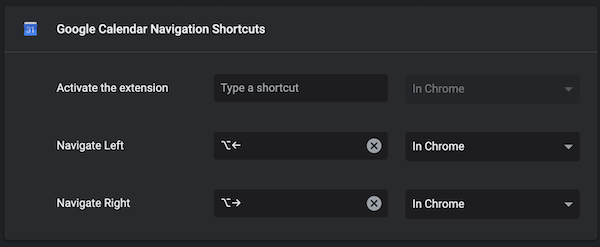

# Google Calendar Nagivation Shortcuts
This chrome extension allows for the navigation of Google Calendar with keyboard shortcuts. The tutorial corresponding with this repo can be found [here](https://codeburst.io/hack-keyboard-shortcuts-into-sites-with-a-custom-chrome-extension-35e884526980?source=friends_link&sk=53d9c12626dd9e59e4e886ddeed19e84).

The default shortcuts are:
- ⌥ (Alt) + ←: go back in time
- ⌥ (Alt) + →: go forward in time

These keys can be changed by visiting `chrome://extensions/shortcuts` in the address bar:

## Installation
1. Clone this repo.
2. Head over to Chrome Extensions (usually `chrome://extensions` in the address bar) and turn "Developer Mode" on the top left.
3. Click "Load unpack" and select the destination as the "src" folder of this cloned repository.
